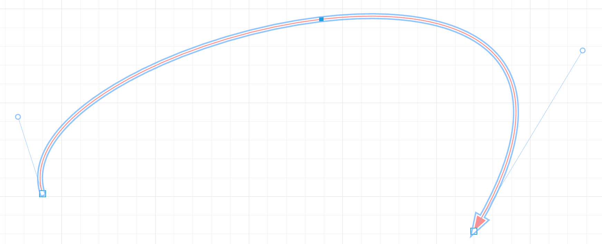

# Drawing Bézier curves by hand in the browser

A bezier curve is a type of line that is actively used in computer graphics systems

For example, in 2d editors these lines usually look like this:


Or like this



We can use svg or canvas to draw in the browser. 

Let's look at these ways.

### Drawing with svg

Consider the following picture


The path tag is used to draw, it is set to 4 points: 1 point where the path starts, 3 points to draw the curve in the following order: red, blue, orange.

```html
<path d="M100,200 C50,100 400,100 400,200" stroke="red" stroke-width="5" fill="none"/>
```

100, 200 - initial green point
The next 3 points:
50, 100 is red.
400, 100 is blue
400, 200 - orange

The full code to draw the picture above:

```html
<svg xmlns="http://www.w3.org/2000/svg" width="500" height="500" version="1.1">
  <line x1="100" y1="200" x2="50" y2="100" fill="none" stroke="#888888" stroke-width="2"/>
  <circle cx="100" cy="200" r="10" fill="lightgreen"/>
  <circle cx="50" cy="100" r="10" fill="red"/>

  <line x1="400" y1="100" x2="400" y2="200" fill="none" stroke="#888888" stroke-width="2"/>
  <circle cx="400" cy="100" r="10" fill="blue"/>
  <circle cx="400" cy="200" r="10" fill="orange"/>
  
  <path d="M100,200 C50,100 400,100 400,200" stroke="red" stroke-width="5" fill="none"/>
</svg>
```

You can extend the curve using the S command.

```html
  <path d="M100,200 S50,100 400,100 400,200 200,200 200,100 200,50 400,50" stroke="red" stroke-width="5" fill="none"/>
```


### Drawing on canvas
As far as I know, you cannot draw a Bézier curve with more than 4 points on canvas using standard methods.

Let's take the case of 4-points.

Let's add a canvas tag in html to draw on it:
```html
<canvas id="canvas" width="500" height="500"></canvas>
```

The context method for drawing is bezierCurveTo.

```js
const canvas = document.getElementById('canvas');
const context = canvas.getContext('2d');

context.beginPath();
context.moveTo(100, 200);
context.bezierCurveTo(50, 100, 400, 100, 400, 200);

context.lineWidth = 5;
context.strokeStyle = 'red';
context.stroke();
```

We get the following picture:


The order of the dots is the same as in svg.

## Drawing algorithm

In this article we will look at the algorithm for drawing a curve by points, or more precisely, by segments. When drawing by points there may be gaps between the points used to draw.

The most reliable way to construct a Bezier curve is the de Casteljo algorithm. 

The editors usually use an initial construction with 4 points - 2 segments. 
We will start the algorithm with the simplest case - 3 points, 2 segments.

It should turn out as follows:


The order in which the points are used is shown in the picture.
The green lines are auxiliary lines. The brown line is the Bézier curve itself.

Consider the Casteljo algorithm.

The key role in the algorithm is played by auxiliary segments, first of all we will consider how to find an additional point for further constructions on them.

### Offset by auxiliary segments

To find the offset, we need to break our auxiliary lines into smaller segments, and use the breakpoints to draw a new segment.

For example, if we use 4 points to draw a curve, then the partitioning of the first segment will look like this:


Take the first point on this segment, the first point on the second segment, and construct a new segment on these points.

The segments should be divided into sub segments in the order of increasing the number of the base point.

The resulting segment should also be divided in the current ratio, by the number of segments into which the segments were divided before, and use the same number of breakpoints as in the segments before. 
I.e., in this case, we'll defer on the segment 1/4 from the beginning. 
We get the next point, which will be the point of our Bezier curve:

Translated with www.DeepL.com/Translator (free version)


Continuing to put off the points, we get the following constructions.

1/2 partition of the segments


3/4 partitioning of segments


The last point can be constructed according to the partitioning rules discussed above, or simply by knowing that the last point in the list of starting points must be included in the construction of the Bézier curve. We obtain the following construction:


Increasing the number of points will result in a smoother drawing.

10 points:


100 points:


## 4 points, n points

Consider the more complicated case of constructing a Bezier curve on 4 points, and write code that can be used for any number of points.

Each of the lines will be divided into the number of segments that we want to use to construct the curve. For clarity, let's divide it into 4 segments. Connect every 2 points with a straight line, in the order of the segments. From 3 segments, we obtain 2.


The obtained 2 segments will be divided similarly into segments, taking in this case the first point of the division, and construct the final segment:


On this segment take the point of the current partition, in this case 1/4 from the beginning of the segment, the resulting point will be a point on the Bézier curve.


Constructing similarly with the 1/2 and 3/4 partitions, connecting to the end point, we get the following Bézier curve on the 4 partitions:


10 points:


100 points:


### Solution idea
We take the number of partitions, in the picture above we took 4, 10, 100.
For example 100.

For each of the partitions we need to get a Bézier curve point. To do this, construct a new segment from each pair of segments next to each 3 points. Thus, for every step, the number of segments and points will decrease by 1.

When only one segment is left, take the point corresponding to the current partition, thus obtaining a Bézier curve point.

Translated with www.DeepL.com/Translator (free version)

## Code

Let's take the following 4 points to construct:

```js
const points = [
  {
    x: 10,
    y: 400,
  },
  {
    x: 300,
    y: 700,
  },
  {
    x: 600,
    y: 700,
  },
  {
    x: 400,
    y: 150,
  },
  {
    x: 600,
    y: 20,
  },
  {
    x: 800,
    y: 300,
  },
];
```

Let's make a canvas tag in html, like this:

```html
<!DOCTYPE html>
<html lang="en">
<head>
    <meta charset="UTF-8">
    <meta http-equiv="X-UA-Compatible" content="IE=edge">
    <meta name="viewport" content="width=device-width, initial-scale=1.0">
    <title>Document</title>
</head>
<body>
    <canvas></canvas>
    <script src="index.js"></script>
</body>
</html>
```

Let's get this canvas, and make the settings to display it:

```js
var canvas = document.getElementsByTagName("canvas")[0];

const size = 1000;
canvas.style.width = size + "px";
canvas.style.height = size + "px";

var ctx = canvas.getContext("2d");

var scale = window.devicePixelRatio;
canvas.width = Math.floor(size * scale);
canvas.height = Math.floor(size * scale);
ctx.scale(scale, scale);
```

Scale is adjusted for a clearer display on retina monitors, where 1 program pixel, has 2 pixels on the physical device.

ctx is the kanvas contet that we will use for drawing.

Let's create a function drawLine, which will draw lines with a thickness of 3:

```js
const drawLine = (ctx, point1, point2, color = "brown") => {
  ctx.beginPath();
  ctx.moveTo(point1.x, point1.y);
  ctx.lineTo(point2.x, point2.y);
  ctx.strokeStyle = color;
  ctx.lineWidth = 3;
  ctx.stroke();
};
```

And let's draw lines, according to our starting points:

```js
for (let i = 0; i < points.length - 1; i++) {
  drawLine(ctx, points[i], points[i + 1], "green");
}
```

We get the following picture:


Let's write an auxiliary function to get a point on the segment, with the current partition. Split the projections of the points on the axes, with the given segmentPosition, we get the desired point.

```js
const getSegmentPointOnLine = (point1, point2, segmentPosition) => {
  return {
    x: point1.x + (point2.x - point1.x) * segmentPosition,
    y: point1.y + (point2.y - point1.y) * segmentPosition
  };
};
``` 

For example, the call

```js
getSegmentPointOnLine({x: 0, y: 0}, {x: 100, y: 60}, 5/100);
```

Returns the point {x: 5, y: 3}.

Let's write a function that returns the points of the Bézier curve.
The input parameters are the initial points and the number of partitions.

```js
const numberOfSegmentsOfCurve = 100;
const bezierCurvePoints = getBezierCurvePoints(points, numberOfSegmentsOfCurve);
```

The outer loop is by the variable numberOfSegments, the number of Bézier curve points we need to get.

The inner loop reduces the points, until one point is left. This point is added to the resulting bezierPoints array.

```js
const getBezierCurvePoints = (points, numberOfSegments) => {
  const bezierPoints = [];

  // loop to get the points of the Bezier curve
  // save the points in the bezierPoints array
  for (let segment = 0; segment <= numberOfSegments; segment++) {
    // the division in which we will divide the segments
    // in the demos above it was 1/4, 2/4, 3/4
    // here, when called with numberOfSegments === 100,
    // it will be 1/100, 2/100, and so on
    // the number of loops will be 101
    // the initial point is counted by the same algorithm, with division = 0,
    // i.e. by taking the beginning of each segment
    // at last iteration, partition will be strictly 1
    // i.e. taking the end of each segment
    const segmentPosition = segment / numberOfSegments;

    // in this variable we will store the points at the current stage of line drawing
    // initial value - initial points
    let currentPoints = points;

    // until only one point remains
    while (currentPoints.length > 1) {
      const newPoints = [];

      // the loop reduces the number of points by one
      for (let i = 0; i < currentPoints.length - 1; i++) {
        const newPoint = getSegmentPointOnLine(
          currentPoints[i],
          currentPoints[i + 1],
          segmentPosition
        );
        newPoints.push(newPoint);
      }

      currentPoints = newPoints;
    }

    bezierPoints.push(currentPoints[0]);
  }

  return bezierPoints;
};
```

Now you can call the function, getting the construction of the Bézier curve.

```js
const bezierCurvePoints = getBezierCurvePoints(points, numberOfSegmentsOfCurve);

for (let i = 0; i < bezierCurvePoints.length - 1; i++) {
  drawLine(ctx, bezierCurvePoints[i], bezierCurvePoints[i + 1]);
}
```

We get the following construction:


Or without auxiliary lines:


