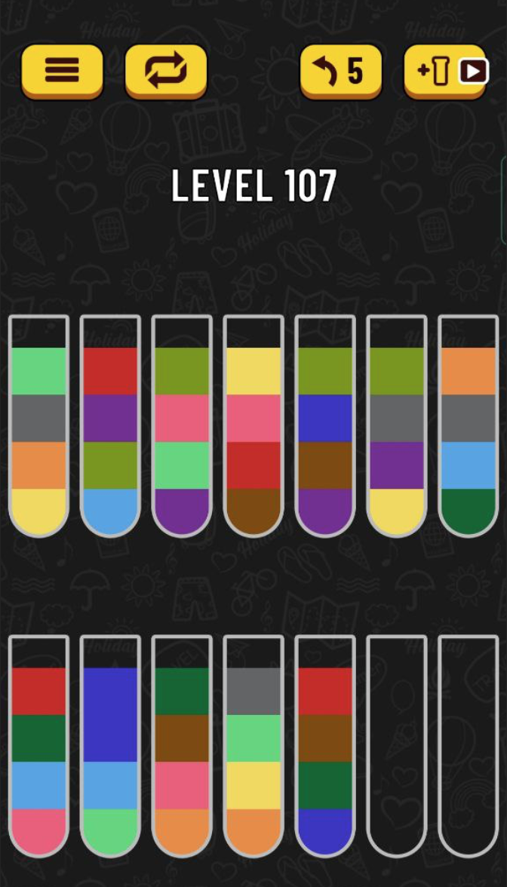
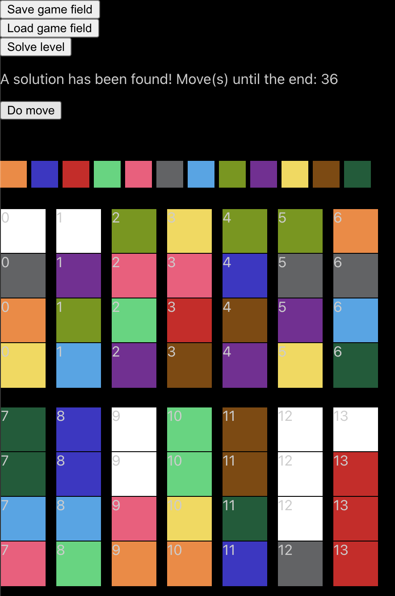

### Water sort game: creating and solving, part 1 - fill the level

Lots of us like to play computer games and this article is about one of the games which practically accidentally was turned out on my phone. This game is about water sorting. We can pour water of the same colors or pour it inside an empty flask.

It's possible to get an additional flask but it isn't interesting and some levels look like an impossible thing to pass. I would like to check is it real for passing or not and to get help for solving some levels.

The following picture contains a 107 level which I tried to pass through for more than a week and it didn't give in to me.



I decided to write my own project to find a solution to this game and to pass through this level.

This article contains a description and key ideas of this implementation.

Full code can be found here: https://github.com/mpetrikov/bottle-game

The final result in the middle of the solution looks like this:


You can select a color for filling flasks. If the place is pushed without selected color then it will become empty.

When the field is ready you can push solve button and this will result in finding a solution. If the solution was found will be shown in line with moves until the end of the level and "Do move" button. Using this button we can find the solution step by step.

# Solution

I decided to use react.js for this game because I know it good enough and the main idea of this code was to find a way to pass through a level.

For modules were using react hooks and css modules for styles.

First of all, an application file contains code for the interaction of different modules. These modules are implemented in their own hooks of react.js.

# Color panel
A color panel is under the controls buttons and it allows to choose color for filling the flasks water parts.

The color panel code has two parts: react component and hook for logic.

Api of hook:
```js
    const [activeColorId, setActiveColorId] = useState(null);
    const [colors] = useState([
        { colorName: '#EC8B3E', id: 2 },
        { colorName: '#3B2FC3', id: 10 },
        { colorName: '#C52B23', id: 4 },
        { colorName: '#63D57D', id: 0 },
    ...

    return {
        colors: usingColors(),
        activeColorId,
        chooseColor,
        getActiveColor,
    };
```

getActiveColor returns full color object consisting of color name and id.

chooseColor is for setting up new color for filling the game field

usingColors returns colors for the current level, because the number of flasks can be different from level to level

And a component which renders colors:

```js
export const Colors = ({ colors: colorsData, activeColorId, chooseColor }) => {
    const chooseColorLocal = useCallback(
        (e) => {
            const dataColorId = e.target.getAttribute('data-color-id');
            if (dataColorId === null) return;
            chooseColor(Number(dataColorId));
        },
        [chooseColor],
    );

    return (
        <div className={styles.colorsLine} onClick={chooseColorLocal}>
            {colorsData.map((colorData) => (
                <div
                    data-color-id={colorData.id}
                    key={colorData.id}
                    className={cn(styles.color, {
                        [styles.colorActive]: activeColorId === colorData.id,
                    })}
                    style={{ backgroundColor: colorData.colorName }}
                ></div>
            ))}
        </div>
```

data-color-id={colorData.id} for getting selected color in one handler without needing of listeners for each color

background color setting through an inline style that is not correct enough but it isn't a commercial project and I chose a faster solution.

# Bottles

Bottles keep in 2d array size of [number of flasks][4]. Where 4 is a number of maximum liquid sections inside a flask. 

I created useBottles hook for keeping information about bottles or in other words game field.

```js
const [bottles, setBottles] = useState([]);
```

The most interesting features are setting up the liquid inside position and moving liquid.

The setting up liquid feature uses where the game field is created.
```js
    const setUpBottleColor = useCallback(
        (bottleId, liquidPosition, activeColor) => {
            const newBottleInfo = bottles.map((bottle) => {
                if (bottle.id === bottleId) {
                    return {
                        ...bottle,
                        colors: [
                            ...bottle.colors.slice(0, liquidPosition),
                            activeColor === null ? defaultBottleColor : activeColor.colorName,
                            ...bottle.colors.slice(liquidPosition + 1, 4),
                        ],
                    };
                }

                return bottle;
            });

            setBottles(newBottleInfo);
        },
        [bottles, setBottles],
    );
```

Here new bottle info is constructed. I find a bottle with bottleId and if I searched then change color in liquidPosition using slice for getting unchanged colors. And if the active color wasn't chosen then clear color in the position setting up default color.

```js
    const moveLiquid = (from, to) => {
        const newBottles = copyBottles(bottles);

        const fromLiquidInfo = getLiquidInfoFromTop(newBottles[from].colors);
        let toSpaceInfo = getTopSpaceInfo(newBottles[to].colors);

        const fromBottleResult = newBottles[from];
        const toBottleResult = newBottles[to];

        for (let i = 0; i < fromLiquidInfo.size; i++) {
            toBottleResult.colors[toSpaceInfo.size - 1 - i] = fromLiquidInfo.color;
            fromBottleResult.colors[fromLiquidInfo.position + i] = defaultBottleColor;
        }

        setBottles(newBottles);
    };
```

The most simple way to change the game field is copying it, changing colors in imperative style in place and after that sets up a new state for react.js.

Addition function for getting info about the bottle. You can understand how they work through inside comments.

```js
export const getLiquidInfoFromTop = (colors) => {
    // if bottle is empty - return null
    let isEmpty = colors.every((color) => color === defaultBottleColor);
    if (isEmpty) return null;

    // color position for counting colors
    let colorPosition = 0;
    // skip default color on the top of a flask
    // if we here then the flask doesn't have default color inside
    while (colors[colorPosition] === defaultBottleColor) colorPosition++;

    // here in colorPosition not default color
    // and here is out color which I want to return from this function
    const topColor = colors[colorPosition];
    let size = 1;

    // counting topColor pieces on the top of bottle
    for (let i = colorPosition + 1; i < colors.length; i++) {
        if (topColor === colors[i]) size++;
        else break;
    }

    return { color: topColor, size, position: colorPosition };
};

export const getTopSpaceInfo = (colors) => {
    // if on the top not default color then the flask is full - return null
    if (colors[0] !== defaultBottleColor) return null;

    // get default colors from top - the the similar const with getLiquidInfoFromTop
    const topColor = defaultBottleColor;
    let size = 1;

    for (let i = 1; i < colors.length; i++) {
        if (topColor === colors[i]) size++;
        else break;
    }

	// if the bottle is empty = default color is in 4 positions of the flask, then we can move any color in this flask
    // if the bottle is not empty - return top color, for defining which color we can move inside this flask
    let availableColor = null;
    if (size !== 4) {
        availableColor = colors[size];
    }

    return { size, availableColor };
};
```
Returning null is not a good enough interface and I faced one or two time problems with it.

# Bottles component
```js
export const Bottle = ({ colors, bottleId }) => {
    return (
        // data-bottle-id is id which generates during creating bottles
        <div className={styles.bottle} data-bottle-id={bottleId}>
            {colors.map((color, index) => (
                <div
                    // using ${index}_${color} as a key is redundantly and I can use just index 
                    key={`${index}_${color}`}
                    // for getting position after click after click on bottle
                    data-liquid-position={index}
                    className={styles.bottleLiquid}
                    style={{ backgroundColor: color }}
                ></div>
            ))}
        </div>
    );
};

export const Bottles = ({ bottlesInfo, chooseColor }) => {
    // the same logic with colors list - click on line for choosing bottle is
    // from data-bottle-id and color position from data-liquid-position
    // "set up color" maybe better name of this function
    const chooseColorLocal = useCallback(
        (e) => {
            const bottleId = Number(e.target.parentElement.getAttribute('data-bottle-id'));
            const liquidPosition = Number(e.target.getAttribute('data-liquid-position'));
            chooseColor(bottleId, liquidPosition);
        },
        [chooseColor],
    );

    // 2 divs for 2 lines of bottles
    // but for storing bottle info uses on the array and here I split it using the slice
	return (
        <>
            <div className={styles.bottleLine} onClick={chooseColorLocal}>
                {bottlesInfo.slice(0, numberOfBottlesInFirstLine).map((bottleInfo) => (
                    <Bottle bottleId={bottleInfo.id} key={bottleInfo.id} colors={bottleInfo.colors} />
                ))}
            </div>
            <div className={styles.bottleLine} onClick={chooseColorLocal}>
                {bottlesInfo.slice(numberOfBottlesInFirstLine).map((bottleInfo) => (
                    <Bottle bottleId={bottleInfo.id} key={bottleInfo.id} colors={bottleInfo.colors} />
                ))}
            </div>
        </>
    );
};
```
# Application
An application uses all top described hooks

```js
    const [bottlesCount] = useState(numberOfBottles);
    const { colors, activeColorId, chooseColor, getActiveColor } = useColors(bottlesCount);
    const { bottles, setUpBottleColor, saveBottlesColors, loadBottlesColors, moveLiquid } = useBottles(bottlesCount);
```

Also, the application has this function for keeping the current filling color that passes through in the Bottle component.

```js
    const chooseColorFromBottle = useCallback(
        (bottleId, liquidPosition) => {
            const activeColor = getActiveColor();

            setUpBottleColor(bottleId, liquidPosition, activeColor);
        },
        [getActiveColor, setUpBottleColor],
    );
```
# Local storage

There is also saving of game field in local storage but it is easy - just stringify and save, and parse for restoring. Of course, if I changed the game field size then we cannot bring back bottle info.

### Description of useSolveLevel module

### Breadth-first search vs depth-First Search

### Possible optimizations

### Conclusion
